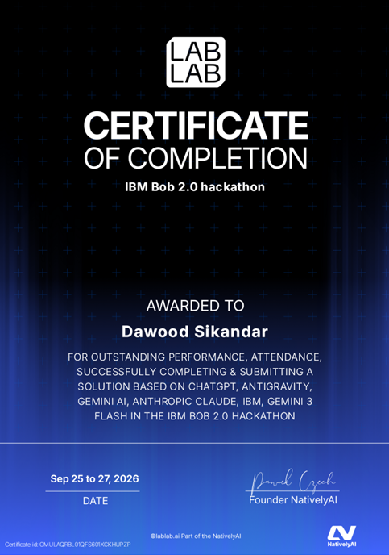

# IBM Bob 2.0 Hackathon

> A hackathon project: AI powered code analysis tool using Google Gemini.

---
## My Participation in **IBM Bob 2.0 Hackathon**

This repository contains my **AI Code Reviewer** project developed during the **IBM Bob 2.0 Hackathon** hosted on **lablab.ai**.

🔗 **Official Hackathon Link:** https://lablab.ai/ai-hackathons/ibm-bob-2-hackathon

---
## Featured On LinkedIn

📣 [**Check out the LinkedIn post here**](https://www.linkedin.com/feed/update/urn:li:activity:7509970540082921472/)

---
## Event Overview

* **Dates:** September 25-27, 2026
* **Hosted on:** lablab.ai

---
## Project Info

| Field              | Details               |
| ------------------ | --------------------- |
| Developed by       | Dawood Sikandar       |
| Hackathon          | IBM Bob 2.0 Hackathon |
| Hackathon Platform | lablab.ai             |
| Hackathon Date     | September 25–27, 2026 |
| Project Type       | Hackathon Project     |
| AI Technology      | Google Gemini API     |

---
## Certificate of Participation



🔗 [**View Full Certificate (PDF)**](https://drive.google.com/file/d/1JH9xoFDJ9Gu2hHl951_DXKlsJMyf9Xaw/view?usp=sharing)

---
## Problem & Solution

**Problem:** Developers waste time manually reviewing code for bugs, security issues, performance problems and style violations especially under deadline pressure.

**Solution:** Paste or upload code, select the language and receive instant structured feedback powered by the Gemini API, including a scored health report, per issue explanations, complexity analysis and a persistent review history.

---
## Implemented Features

### Code Review

* **AI Code Review**: Reviews code using Gemini and finds bugs and security issues.
* **Code Health Score**: Gives a score from 0–100 based on the issues found.
* **AI Summary**: Gives a short summary of the code.
* **Complexity Analysis**: Shows time complexity and space complexity with an optimization suggestion.
* **Issue Filters**: Filter issues by Bug, Security, Performance and Quality.

### Code Input

* **File Upload**: Upload source files directly for review.
* **Language Detection**: Detects the language from the file extension.
* **Input Validation**: Checks the code on both client and server side.
* **Copy Report**: Copies the review results as plain text.

### Review History

* **Review History**: Saves previous reviews in SQLite.
* **History Search**: Search reviews by language, score, date or complexity.
* **Load Past Review**: Open previous reviews again.
* **History Refresh**: Refresh the review history.

### Interface

* **Dark / Light Theme**: Switch between dark and light mode.
* **Live Clock**: Shows the current time and date.
* **Toast Notifications**: Shows success and error messages.
* **Loading Skeleton**: Shows a loading animation during review.
* **Retry on 503**: Retries the request when Gemini returns a temporary 503 error.

---
## Project Structure

```
ai-code-reviewer/
├── backend/
│   ├── server.js       # Express server, API routes, validation, Gemini integration
│   ├── db.js           # SQLite schema, prepared statements, saveReview / getHistory / getReviewById
│   └── reviews.db      # SQLite database file (git-ignored)
├── frontend/
│   ├── index.html      # Single-page HTML with all sections (hero, review card, results, history)
│   ├── script.js       # All client-side logic (review flow, history, clock, theme, toasts, copy)
│   └── style.css      # Dark/light theme styles, animations, responsive layout
├── .env                # Environment variables (git-ignored)
├── .gitignore
├── package.json
└── package-lock.json
```

---
## Setup & Run

### Prerequisites

* Node.js 22+ (uses the built-in `node:sqlite` module - no external SQLite dependency required)

### 1. Install dependencies

```bash
npm install
```

### 2. Create the environment file

Create a `.env` file in the project root with the following variable:

```
GEMINI_API_KEY=your_key_here
```

> Only the variable **name** is listed above. Do not commit your actual key.

### 3. Start the server

```bash
node backend/server.js
```

The app is served at **http://localhost:3000**

---
## How to Use

1. Open **http://localhost:3000** in a browser.
2. **Select a language** from the dropdown.
3. **Paste code** or click **Upload Files** to upload a source file.
4. Click **Review Code** to analyze the code.
5. View the **Code Health Score**, AI summary, complexity analysis and detected issues.
6. Use the **filters** to view specific issue types.
7. Use **Copy Report** to copy the review results.
8. Scroll down to **Review History** to view or reload previous reviews.
9. Use the **search box** to find previous reviews.

---
## Supported Languages

| Language   | File Extensions               |
| ---------- | ----------------------------- |
| JavaScript | `.js`, `.jsx`                 |
| TypeScript | `.ts`, `.tsx`                 |
| Python     | `.py`                         |
| Java       | `.java`                       |
| C          | `.c`, `.h`                    |
| C++        | `.cpp`, `.cc`, `.cxx`, `.hpp` |

---
## Author

**Dawood Sikandar**

Developed for the **IBM Bob 2.0 Hackathon** on **lablab.ai**.
