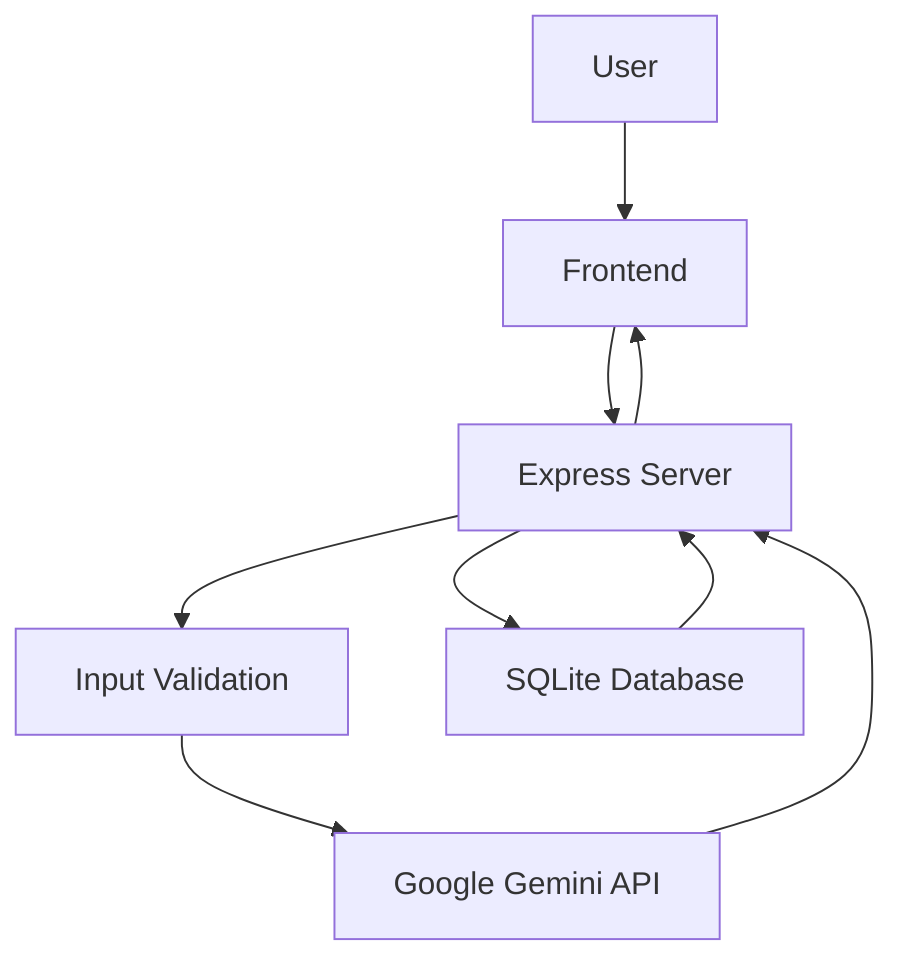
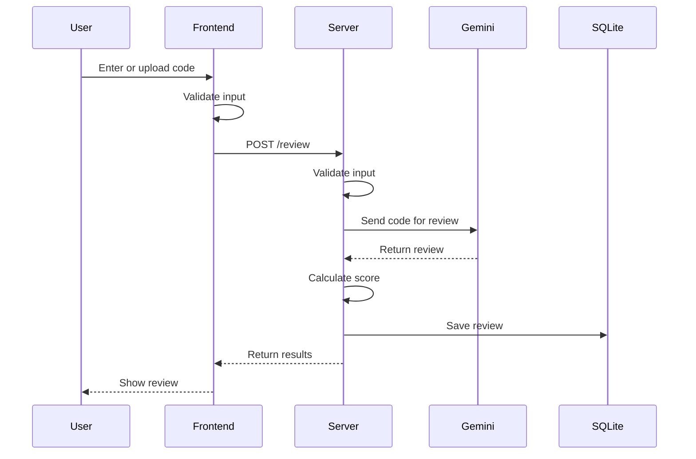
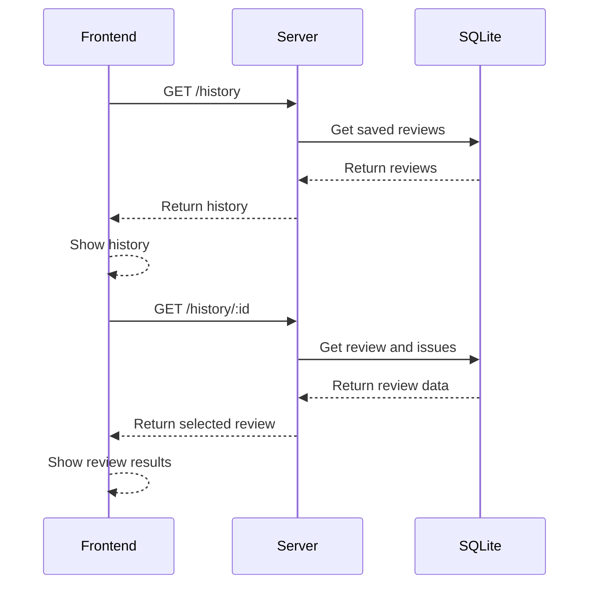

# Architecture - AI Code Reviewer

**Project Type: Hackathon Project**

## Overview

AI Code Reviewer is a simple web application built with a frontend, a Node.js backend and a local SQLite database.

The frontend handles the user interface and sends requests to the backend. The backend validates the submitted code, sends valid requests to Google Gemini and saves completed reviews in SQLite.

The saved reviews can then be viewed again through the History section.

## System Architecture



## Frontend

The frontend is built with HTML, CSS and Vanilla JavaScript.

It handles:

* Code input and file upload
* Language selection
* Input validation
* Review requests
* Review result display
* Issue filters
* History search
* Dark and Light mode
* Live clock
* Loading states
* Toast notifications
* Copy Report

## Backend

The backend uses Node.js and Express.

It is responsible for:

* Serving the frontend
* Receiving review requests
* Validating user input
* Checking supported languages and file types
* Checking language mismatch
* Sending valid code to Gemini
* Processing the AI response
* Calculating the Code Health score
* Saving reviews to SQLite
* Returning results and history to the frontend

## Review Flow



## Gemini Integration

Google Gemini is used to analyze valid code.

The AI review can provide:

* Bugs
* Security issues
* Performance issues
* Code quality issues
* Time complexity
* Space complexity
* Optimization suggestions
* A short review summary

The Gemini API key is kept on the server and is not exposed to the frontend.

## Validation

Validation is handled on both the frontend and backend.

The application checks:

* Empty input
* Unsupported languages
* Unsupported file types
* Obvious non code input
* Language mismatch

Invalid input is rejected before the Gemini request is made. This helps prevent unnecessary API usage.

## Code Health Score

The Code Health score is calculated from the issues found during the review.

Each issue type has a different penalty and the final score is kept between 0 and 100.

The score is shown in the results section using a visual score ring.

## Database

The application uses SQLite to store review history.

There are two main tables:

### `reviews`

Stores the main information about each review, including:

* Review ID
* Date and time
* Language
* Code health score
* Issue counts
* Time complexity
* Space complexity
* AI summary

### `issues`

Stores the individual issues found in a review.

Each issue is connected to its related review.

## History Flow



## Main API Routes

| Route              | Purpose                                |
| ------------------ | -------------------------------------- |
| `POST /review`     | Validates and reviews submitted code   |
| `GET /history`     | Returns saved reviews                  |
| `GET /history/:id` | Returns a saved review with its issues |

## Project Structure

```text
ai-code-reviewer/
├── backend/
│   ├── server.js
│   └── db.js
├── frontend/
│   ├── index.html
│   ├── script.js
│   └── style.css
├── .env
├── .gitignore
├── package.json
└── package-lock.json
```

## Security

The Gemini API key is stored in the server environment and is not included in the frontend.

The backend also performs its own validation so invalid requests cannot simply bypass the frontend checks.
