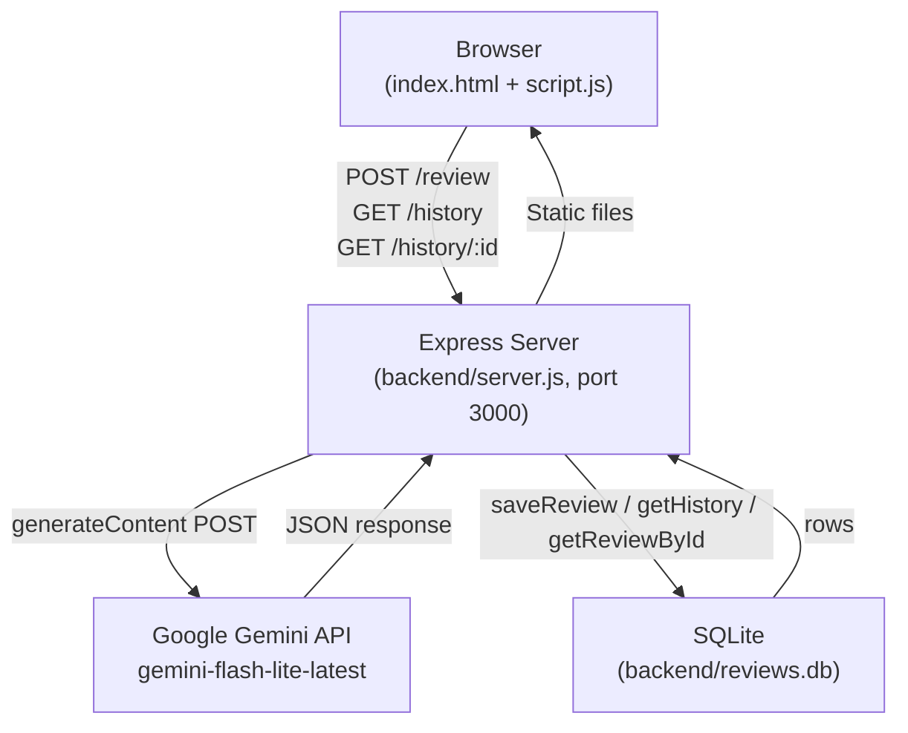
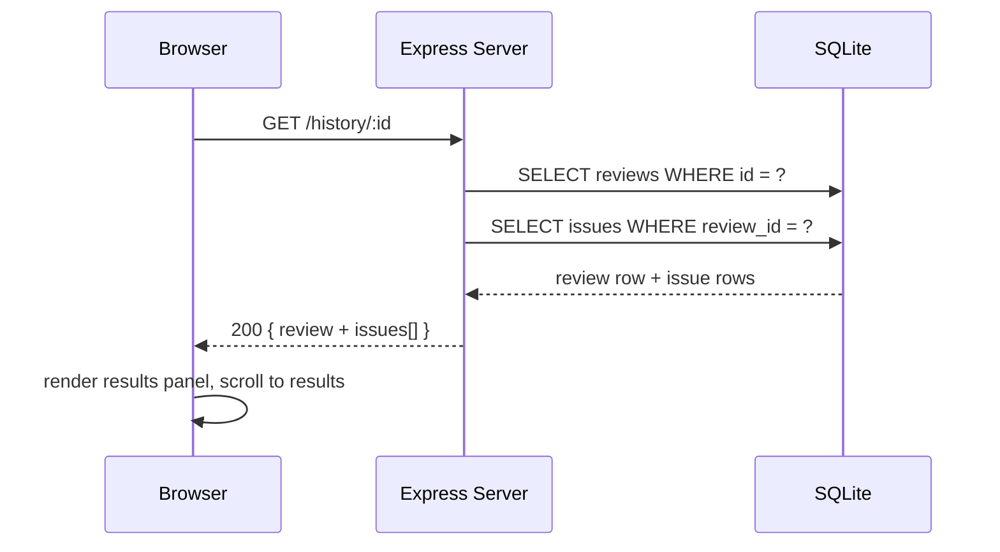

# Architecture — AI Code Reviewer

---

## Overview

A single-server web application. The Express backend serves the static frontend and exposes three REST endpoints. There is no separate build step — the browser loads plain HTML, CSS, and JavaScript directly from the `frontend/` directory. All review data is persisted to a local SQLite database using Node.js's built-in `node:sqlite` module.

---

## Component Map

```
┌─────────────────────────────────────────────────────────┐
│                        Browser                          │
│                                                         │
│  index.html  ──  style.css  ──  script.js               │
│                                                         │
│  • Code input (textarea / file upload)                  │
│  • Client-side validation (looksLikeCode, detectMismatch│
│  • Fetch → POST /review                                 │
│  • Fetch → GET  /history                                │
│  • Fetch → GET  /history/:id                            │
│  • Renders: score ring, summary cards, issue cards,     │
│    complexity card, AI summary, history list, toasts    │
└──────────────────────┬──────────────────────────────────┘
                       │ HTTP (same origin, port 3000)
┌──────────────────────▼──────────────────────────────────┐
│                   Express Server                         │
│                   (backend/server.js)                    │
│                                                         │
│  Static files → frontend/                               │
│  POST /review                                           │
│    1. Validate: language, looksLikeCode, detectMismatch │
│    2. Build prompt                                       │
│    3. Call Gemini API (retry ×5 on 503)                 │
│    4. Parse JSON response                               │
│    5. Calculate score                                    │
│    6. Save review to SQLite                             │
│    7. Return JSON to client                             │
│  GET  /history   → return all reviews (newest first)    │
│  GET  /history/:id → return one review + its issues     │
└──────────────┬─────────────────┬───────────────────────┘
               │                 │
   ┌───────────▼──────┐   ┌──────▼──────────────────────┐
   │   SQLite DB       │   │   Google Gemini API          │
   │ (reviews.db)      │   │ gemini-flash-lite-latest     │
   │                   │   │                              │
   │  Table: reviews   │   │ POST …/generateContent       │
   │  Table: issues    │   │ responseMimeType:            │
   │                   │   │   application/json           │
   └───────────────────┘   └──────────────────────────────┘
```

---

## API Flow

### POST /review

```
Client                        Server                       Gemini API
  │                              │                              │
  │── POST /review ─────────────▶│                              │
  │   { code, language }         │                              │
  │                              │─ validate input ────────────▶│
  │                              │  (400 if invalid)            │
  │                              │                              │
  │                              │── POST generateContent ──────▶│
  │                              │   { prompt, responseMimeType }│
  │                              │                              │
  │                              │◀─ 200 { candidates[0].text } ─│
  │                              │   (JSON string)              │
  │                              │                              │
  │                              │─ parse + calculate score     │
  │                              │─ saveReview() → SQLite       │
  │                              │                              │
  │◀─ 200 { issues, score, ─────│
  │    summary, time_complexity, │
  │    space_complexity,         │
  │    optimization_suggestion,  │
  │    id } ─────────────────────│
```

### GET /history

```
Client                        Server                        SQLite
  │── GET /history ────────────▶│                              │
  │                              │── SELECT reviews ORDER BY ──▶│
  │                              │   id DESC                    │
  │◀─ 200 [ { id, language,  ───│◀─ rows ──────────────────────│
  │    score, total_issues,      │
  │    security, performance,    │
  │    quality, time_complexity, │
  │    space_complexity,         │
  │    summary, created_at } ]   │
```

### GET /history/:id

```
Client                        Server                        SQLite
  │── GET /history/42 ─────────▶│                              │
  │                              │── SELECT reviews WHERE id=? ▶│
  │                              │── SELECT issues WHERE        │
  │                              │   review_id=? ──────────────▶│
  │◀─ 200 { review + issues[] } ─│◀─ rows ──────────────────────│
```

---

## Database Schema

### Table: `reviews`

| Column           | Type    | Notes                                    |
|------------------|---------|------------------------------------------|
| `id`             | INTEGER | Primary key, autoincrement               |
| `created_at`     | TEXT    | ISO 8601 UTC timestamp (SQLite default)  |
| `language`       | TEXT    | One of: javascript, typescript, python, java, c, cpp |
| `score`          | INTEGER | 0–100, computed penalty score            |
| `total_issues`   | INTEGER | Total count of all issues                |
| `security`       | INTEGER | Count of security-severity issues        |
| `performance`    | INTEGER | Count of performance-severity issues     |
| `quality`        | INTEGER | Count of quality-severity issues         |
| `time_complexity`| TEXT    | Big-O string, default `'N/A'`            |
| `space_complexity`| TEXT   | Big-O string, default `'N/A'`            |
| `summary`        | TEXT    | AI plain-English summary, default `''`   |

### Table: `issues`

| Column       | Type    | Notes                                         |
|--------------|---------|-----------------------------------------------|
| `id`         | INTEGER | Primary key, autoincrement                    |
| `review_id`  | INTEGER | Foreign key → `reviews(id)` ON DELETE CASCADE |
| `line`       | INTEGER | Line number reported by AI (nullable)         |
| `severity`   | TEXT    | `bug`, `security`, `performance`, or `quality`|
| `message`    | TEXT    | Issue description                             |
| `suggestion` | TEXT    | Fix recommendation                            |

---

## Score Calculation

Computed identically on both server and client (kept in sync):

```
penalty = (bug_count × 15) + (security_count × 20)
        + (performance_count × 10) + (quality_count × 5)
score   = max(0, 100 − penalty)
```

Score colour thresholds:
- ≥ 80 → green (`#40d47a`)
- ≥ 50 → yellow (`#f5c542`)
- < 50 → red (`#ff6b6b`)

---

## Validation Heuristics

Both `server.js` and `script.js` implement the same two functions (kept in sync manually):

**`looksLikeCode(text)`** — Returns `false` (rejects) when:
- Input is shorter than 10 characters
- Input matches a list of common plain-text greetings/phrases
- Input is a single line shorter than 60 characters with no code tokens

Returns `true` (allows) when:
- Any recognised code token is found (`{}[]();=>` operators, keywords such as `function`, `const`, `def`, `class`, `import`, etc.)
- Input has more than 2 lines (treated as structured content)

**`detectMismatch(code, language)`** — Uses per-language regex signatures to detect if the code strongly signals a different language than selected. C/C++ and JavaScript/TypeScript are treated as families and do not flag each other.

---

## Gemini Integration

- **Endpoint:** `https://generativelanguage.googleapis.com/v1beta/models/gemini-flash-lite-latest:generateContent`
- **Auth:** API key via query parameter (`?key=…`)
- **Request body:** single user-role message with the review prompt; `generationConfig.responseMimeType = "application/json"`
- **Response path:** `candidates[0].content.parts[0].text` — parsed as JSON
- **Retry policy:** up to 5 attempts, starting at 1 500 ms delay, doubling each attempt (exponential back-off), triggered only on HTTP 503

---

## Mermaid Diagrams

### System Architecture



### Review Request Sequence

```mermaid
sequenceDiagram
    participant B as Browser
    participant S as Express Server
    participant G as Gemini API
    participant D as SQLite

    B->>S: POST /review { code, language }
    S->>S: validate (language, looksLikeCode, detectMismatch)
    S->>G: POST generateContent (prompt + responseMimeType:json)
    G-->>S: 200 { candidates[0].content.parts[0].text }
    S->>S: parse JSON, calculate score
    S->>D: BEGIN; INSERT reviews; INSERT issues; COMMIT
    D-->>S: lastInsertRowid
    S-->>B: 200 { issues, score, summary, complexities, id }
    B->>B: animate score ring, render issue cards, show toast
    B->>S: GET /history
    S->>D: SELECT reviews ORDER BY id DESC
    D-->>S: rows
    S-->>B: 200 [ review rows ]
    B->>B: render history list
```

### History Load Sequence


